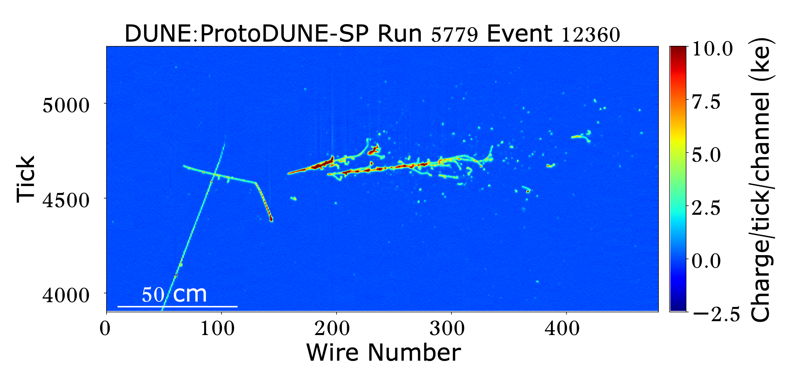

# Vikas Gupta
Experimental physicist with 5+ years in precision instrumentation and data analysis, working at CERN, Nikhef, and TU Munich on some of the largest and most sensitive particle detectors ever built to answer questions about the origin and composition of the universe. 

## Projects

| | | |
|---|---|---|
|  | **VULCAN** | Optical characterisation of detector materials at deep UV wavelengths |
|  | **ProtoDUNE Analysis** | Particle reconstruction and cross-section measurement in a 1-kilotonne detector |
|  | **PEN Study** | Long-term stability of a novel detector coating in cryogenic conditions |

## Publications
[JINST 2025](link) · [Nature Physics 2022](link) · [LinkedIn](link)
## Projects

<table>
<tr>
<td width="33%" align="center">
 
<b>VULCAN</b> 
Optical characterisation of detector materials at deep UV wavelengths
</td>
<td width="33%" align="center">
 
<b>ProtoDUNE Analysis</b> 
Particle reconstruction and cross-section measurement in a 1-kilotonne detector at CERN
</td>
<td width="33%" align="center">
 
<b>PEN Study</b> 
Long-term stability of a novel detector coating in cryogenic conditions
</td>
</tr>
</table>

<!--
**vikasnt/vikasnt** is a ✨ _special_ ✨ repository because its `README.md` (this file) appears on your GitHub profile.

Here are some ideas to get you started:

- 🔭 I’m currently working on ...
- 🌱 I’m currently learning ...
- 👯 I’m looking to collaborate on ...
- 🤔 I’m looking for help with ...
- 💬 Ask me about ...
- 📫 How to reach me: ...
- 😄 Pronouns: ...
- ⚡ Fun fact: ...
-->
