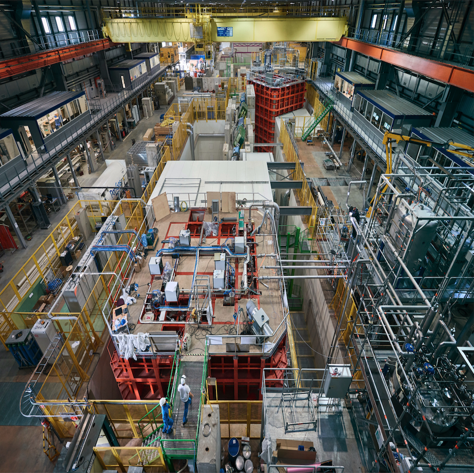
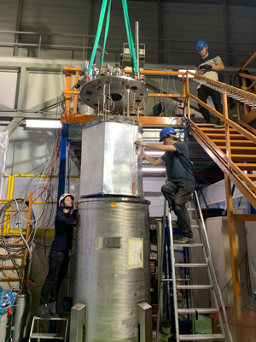
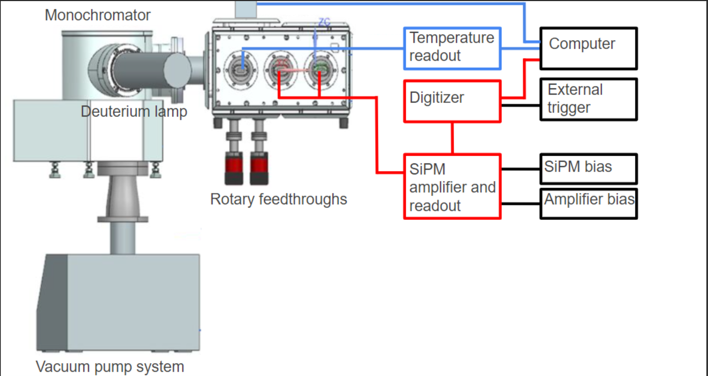

# Vikas Gupta | [LinkedIn](https://www.linkedin.com/in/vikas-gupta-158478107/)
Experimental physicist with 5+ years in precision instrumentation and data analysis, working at CERN, Nikhef, and TU Munich on some of the largest and most sensitive particle detectors ever built to answer questions about the origin and composition of the universe. 

## Projects
<table>
<tr>
<td align="center">

</td>
<td>
<b>ProtoDUNE Analysis</b> 
Neutral pion reconstruction in an 800-tonne liquid argon detector at CERN. CNN-based shower identification and invariant mass reconstruction recover the π⁰ mass peak at 135 MeV, validating the shower energy reconstruction and analysis pipeline on 1 GeV pion beam data.
</td>
<td>
Python · NumPy · SciPy · Matplotlib · Shapely 
<a href="https://github.com/vikasnt/protodune-analysis">→ Analysis code</a>
</td>
</tr>
<tr>
<td align="center">

</td>
<td>
<b>PEN Wavelength Shifter Characterisation</b> 
Daily alpha and muon light yield tracking in a 2-tonne cryogenic detector at CERN over 12 days, with argon purity correction via triplet lifetime monitoring. Spatial scan data compared to GEANT4 simulation constrains PEN wavelength-shifting efficiency to 45–58%, supporting its use in future large-scale liquid argon detectors.
</td>
<td>
Python · NumPy · Matplotlib · uproot · lmfit · numba 
<a href="https://github.com/vikasnt/pen-study">→ Analysis code</a>
</td>
</tr>
<tr>
<td width="25%" align="center">

</td>
<td width="40%">
<b>VULCAN</b> 
Measured how detector materials reflect light at vacuum UV wavelengths 
where standard tools don't work. Results directly informed detector 
simulation models for DUNE.
</td>
<td width="35%">
Python · NumPy · Matplotlib · DAQ 
<a href="https://github.com/vikasnt/vulcan">→ Analysis code</a>
</td>
</tr>
</table>

